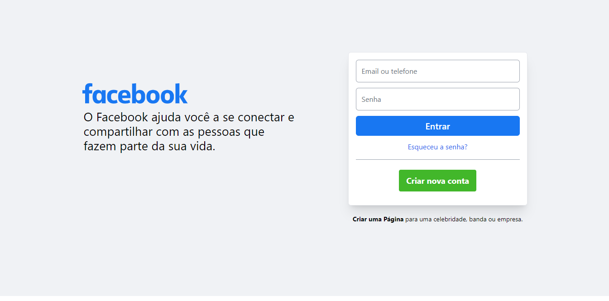

# Clone-Facebook
 Clone da tela de login do facebook, projeto feito em curso da plataforma [Udemy](https://www.udemy.com/) para o treinamento da tecnologia [Tailwindcss](https://tailwindcss.com/)
 
 - ***compatível com dispositivos móveis***
 
 ### Tecnologias utilizadas:

 - Html
 - Tailwindcss
 - Javascript

 ### Veja o site aqui:
https://pabloquirino.github.io/facebook-clone/src/

### Captura de tela:
  
 

